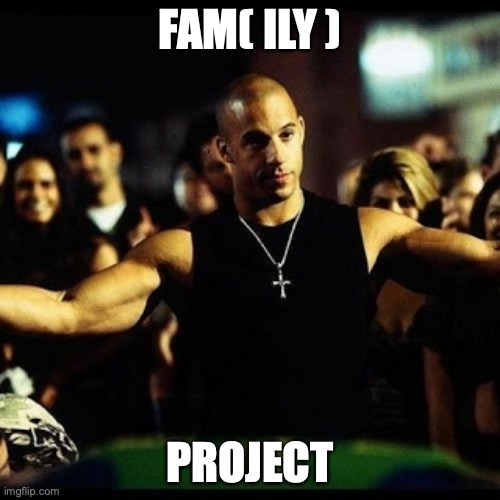

# Fampay Interview Assignment 🌋
Goal: To make an API to fetch the latest videos sorted in reverse chronological order of their publishing date-time from YouTube for a given tag/search query in a paginated response.

### Tasks ✅

- [x] The server should call the YouTube API continuously in the background (async) with some interval (say 10 seconds) for fetching the latest videos for a predefined search query and should store the data of videos (specifically these fields 
- - [x] Video title, description, publishing DateTime, thumbnail URLs and any other fields you require) in a database with proper indexes.

- [x] A GET API that returns the stored video data in a paginated response sorted in descending order of published DateTime.

- [x] A basic search API to search the stored videos using their title and description.

- [x] Dockerize the project.

- [x] It should be scalable and optimized.

Bonus Points ✨:

- [x] Add support for supplying multiple API keys so that if the quota is exhausted on one, it automatically uses the next available key.

- [ ] Make a dashboard to view the stored videos with filters and sorting options (optional).

- [x] Optimize search API so that it's able to search videos containing a partial match for the search query in either video title or description.

> Ex 1: A video with title *`How to make tea?`* should match the search query `tea how`

# How to run ❓

The application is completely dockerized and can be run using the following command:

```bash
docker-compose up --build
```

The application is running on port `8888` and can be accessed using the following URL:

[localhost:8888](localhost:8888)

The API documentation is available at the following URL:

[localhost:8888/docs](localhost:8888/docs)

You can use the same to quickly test the application.

## Logging 📝

The application logs are available in the console and in the
`fam(ily).log` file in the root directory.

# Application Stack 🏡

- Docker
- FastAPI
- Uvicorn (async server)
- MongoDB
## NOTICE ⚠️
THIS IS A MPL 2.0 LICENSED PROJECT. IT IS A COPYLEFT LICENSE.

MPL 2.0: https://www.mozilla.org/en- [x]US/MPL/2.0/

# Because it's about Fam(ily) 🤗


(Had to squeeze the meme in)